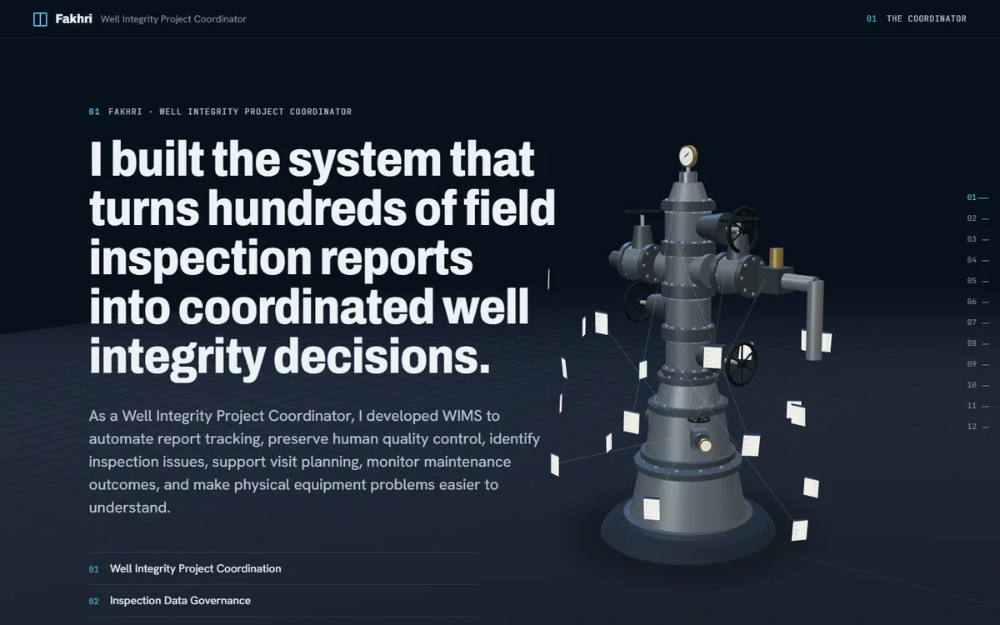

# Well Integrity Project Coordinator · OSES Case Study

A scroll-driven 3D portfolio about Fakhri's role as Well Integrity Project
Coordinator on the OSES wellhead and X-mas tree preventive-maintenance project:
contract and P&L setup, HSE governance, crew and equipment readiness, two
vessel-based field crews, WIMS inspection data, integrity review, commercial
control and client SPR reviews.

**Live demo:** https://muhammadfakhri-helmi.github.io/Project-Coordinator-WIMS-Portofolio/



> **Disclaimer.** This portfolio uses sanitized and simplified representations
> of project workflows. It does not publish client records, original
> inspection reports, contract values, proprietary engineering data, or
> certified equipment geometry. Documentary photographs are real project
> records, redacted before upload.

## What it shows

Eleven chapters, one continuous scroll:

1. The Project Coordinator — headline and a wellhead assembling from a dark silhouette
2. A controlled plan — Contract Review → P&L → HSE Plan → Bridging Document → Crew Matrix → Equipment Readiness → Mobilization
3. Crew and equipment readiness — filterable readiness matrix and count-once outcome counters
4. Field execution — abstract route map with two vessel loops, selectable routes and nodes (SVG on small screens)
5. From field reports to WIMS — the 8-step data pipeline, then the original WIMS scenes (5.1–5.8)
6. Wellhead integrity model — eight selectable components, status colours, linked report and next visit, 53% → 68% team result
7. Continuous evaluation — three review layers and a finding followed to closure
8. HSE governance — control relationships and verified project-period indicators
9. Commercial control — revenue, invoice status, cost, margin and opportunity shown separately; TKDN
10. SPR and client review — two synchronized panels
11. The connected role — the whole control system, closing statement, link back to the WIMS case study

Design spec: `docs/superpowers/specs/2026-09-25-oses-project-coordinator-design.md`.

## Documentary photographs

Upload the five **pre-redacted** photographs to
`portfolio-assets/oses-project-coordinator/real-documentary/` (names in the README
there), then run:

```bash
python3 tools/build_documentary.py
```

It writes resized WebP/AVIF files to `public/assets/documentary/` (only
resizing and re-encoding; metadata dropped). The page adds its grade, grain and
vignette; confidential content is redacted in the source photos, not by page overlays.

## Features

- Scroll-controlled camera and report-sheet animation (Three.js, GSAP ScrollTrigger)
- Constrained orbit and zoom, clickable components, keyboard-operable hotspot buttons
- Records table ↔ 3D markers ↔ detail panel, with a leader line on wide screens
- SVG chart with a written summary and data table
- Full narrative in semantic HTML; works without WebGL (SVG schematic) and without JavaScript (static text)
- `prefers-reduced-motion`: every scene shown in its resolved state, no travel
- Mobile mode: lighter geometry, fewer sheets, vertical layouts, touch-friendly controls
- Render-on-demand loop, capped pixel ratio, no shadow maps, lazy screenshots, 3D code split into its own chunk

## Technology

Vite · Three.js · GSAP + ScrollTrigger · vanilla JavaScript (ES modules) ·
modular CSS · SVG · self-hosted fonts (Archivo, Hanken Grotesk, JetBrains Mono).
No backend, API keys, accounts or external services.

## Run locally

Requires Node.js 20.19+ (22 recommended, see `.nvmrc`).

```bash
npm install
```

```bash
npm run dev
```

Open the URL Vite prints (default http://localhost:5173).

## Production build

```bash
npm run build
```

```bash
npm run preview
```

`npm run check` runs the privacy/hygiene scan on the source;
`npm run check:dist` also scans the build.

The base path is read from `BASE_PATH` (default `./`, relative URLs). Relative
URLs work from a domain root, a GitHub Pages project subpath or any folder. Use
`BASE_PATH=/` for a custom domain root or `BASE_PATH=/<repository>/` if you
prefer absolute Pages URLs.

## Deploy to GitHub Pages

1. Create a GitHub repository and push this folder (and only this folder) to its `main` branch.
2. In the repository: **Settings → Pages → Build and deployment → Source: GitHub Actions**.
3. Push to `main` (or run the workflow manually). `.github/workflows/deploy-pages.yml`
   runs `npm ci`, `npm run check`, `npm run build`, `npm run check:dist`, uploads `dist/`
   and deploys it with the official Pages actions and the built-in token.
4. Paste the resulting URL into “Live demo” above.

It is a single page with no client-side routing, so refreshing never produces a 404.

## Repository structure

```
.github/workflows/deploy-pages.yml   GitHub Pages CI
docs/                                design system, asset manifest, privacy and release checks
public/assets/screenshots/           8 sanitized WebP screenshots (only public images)
public/assets/models/, textures/     empty on purpose (procedural model) — see READMEs inside
src/main.js                          entry: HTML components first, 3D lazily
src/styles/                          tokens, base, layout, components
src/content/                         fictional demonstration data
src/components/                      archive filters, trend chart, viewer, equipment UI, SVG fallback
src/scenes/story.js                  scroll choreography
src/three/                           stage, procedural wellhead, report sheets, layouts
src/utils/                           environment helpers
scripts/check.mjs                    privacy / hygiene checker
tools/sanitize_screenshots.py        reproducible screenshot sanitization
index.html                           the whole narrative, readable without JS
```

## The 3D model

The wellhead and X-mas tree are **procedurally generated from Three.js
primitives in `src/three/wellhead.js`** — original code written for this
portfolio. Components: casing head, tubing spool with an annulus outlet,
adapter flange, lower and upper master valves, flow cross, production and kill
wing valves, choke, swab valve, tree cap and pressure gauge. Proportions are
generic; the model contains no ratings, dimensions or field configuration.

On the page it is labelled: *Simplified interactive wellhead/X-mas tree
visualization for portfolio communication.* It is a communication tool, not a
certified engineering representation or digital twin.

### Replacing the procedural model with a GLB

1. Use an original or properly licensed model; record creator, source, license
   and modifications in `docs/ASSET_MANIFEST.md`.
2. Optimise it (e.g. `npx @gltf-transform/cli optimize in.glb out.glb --compress draco --texture-compress webp`), aim for < 10 MB.
3. Put it in `public/assets/models/`.
4. In `src/three/wellhead.js`, load it with `GLTFLoader` (+ `DRACOLoader`) instead of building primitives, and
   return the same shape: `root`, `pickables` (meshes with `userData.part`), `highlight()`, and an `anchors`
   object with `Object3D`s named `master, swab, wing, choke, gauge, flange, annulus`.
   Empties with those names in the GLB make this a one-line lookup.
5. Load it with `import.meta.env.BASE_URL + 'assets/models/<file>.glb'` so it respects the base path.

## Assets and licenses

- Portfolio code: MIT (`LICENSE`).
- Sanitized screenshots of WIMS: viewing only, not licensed for reuse.
- Third-party code and fonts: three.js (MIT), GSAP (standard no-charge license),
  fonts (SIL OFL 1.1) — see `THIRD_PARTY_NOTICES.md`.
- No external models, textures, icons or stock images.

## Privacy

This repository is public-facing. It contains no inspection workbooks, no
PDF or CSV, no original screenshots, no WIMS source code or binaries, no client,
well or personnel identifiers, no internal links and no local paths. All wells,
platforms, people, files, dates and figures are fictional. Original reports
remain controlled within the internal WIMS environment; the site offers no
download of any source document.

Before every publish: run `npm run check:dist` after `npm run build`. For the
strongest check, keep a local `.privacy-terms.local.txt` (git-ignored) listing
real client, well and personnel identifiers — the checker fails if any appear.
Details: `docs/PRIVACY_CHECK.md`, `docs/PUBLIC_REPOSITORY_AUDIT.md`.

## Known limitations

- The model is illustrative; component placement is generic.
- Hotspot markers do not test full occlusion; markers behind the tree are dimmed instead.
- Screenshots are raster images; they are captioned and have alt text but their inner text is not selectable.
- Very old GPUs fall back to the SVG schematic; there is no intermediate WebGL quality tier beyond mobile/desktop.
- On first visit fonts load with `font-display: swap`, so headline metrics can shift slightly.
